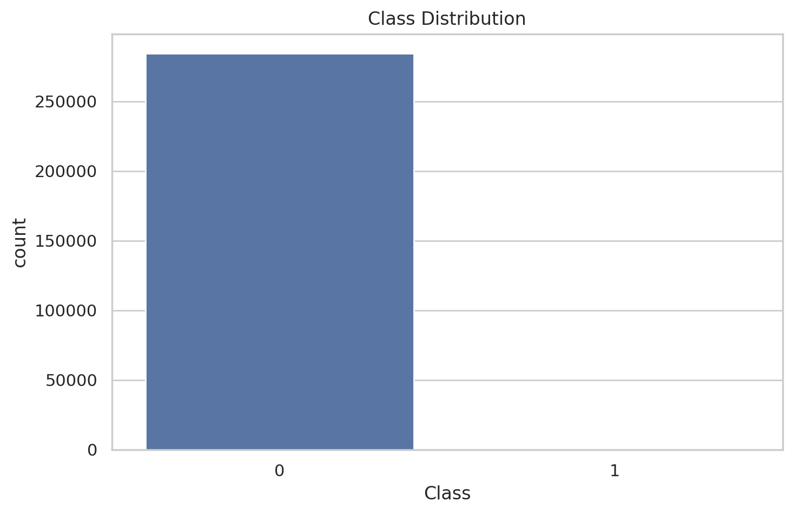
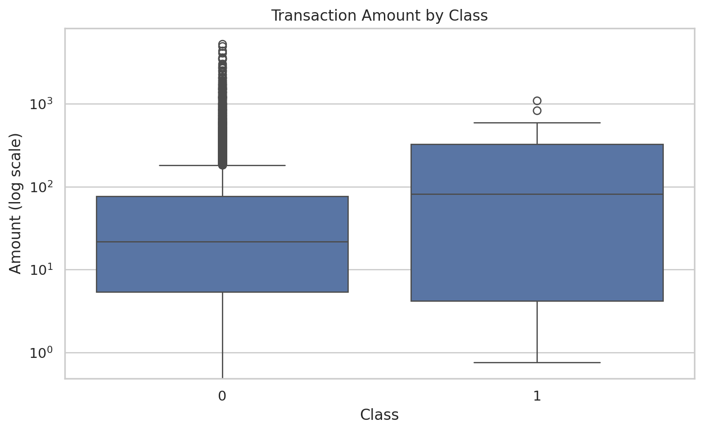
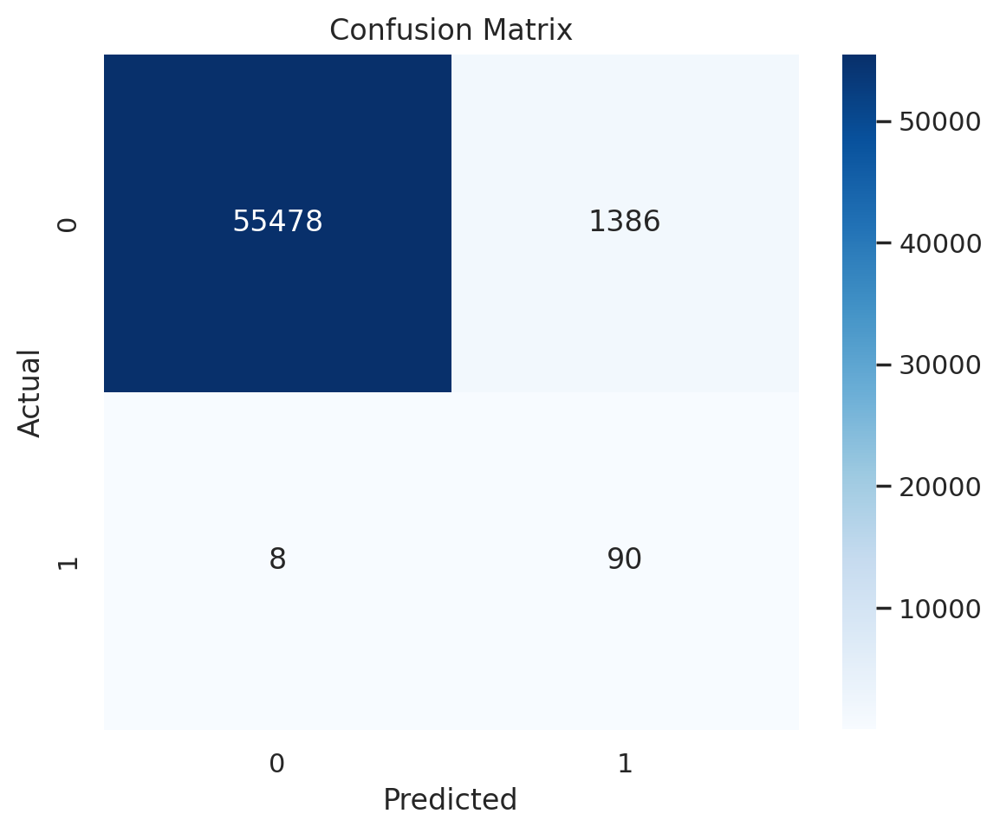
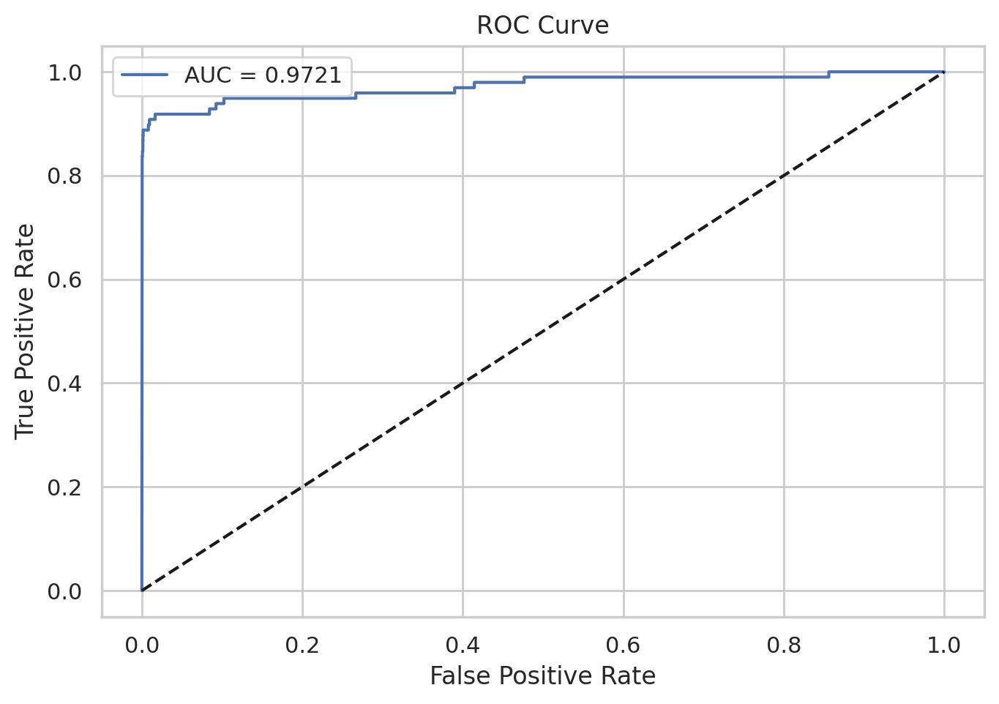
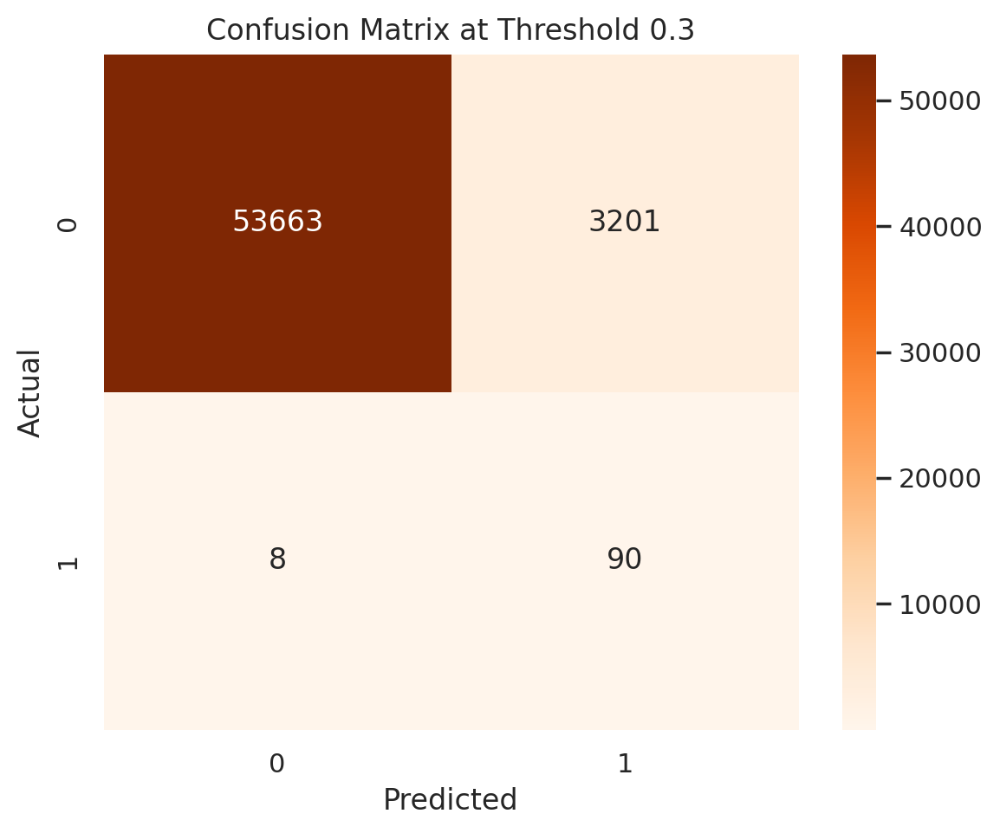

# Credit Card Fraud Detection for Payments Risk

This project applies machine learning to detect fraudulent credit card transactions using the Kaggle Credit Card Fraud Detection dataset. It is designed as a small payments-focused ML project that combines data analysis, fraud risk modeling, and business interpretation in a way that is relevant to banking and payments teams.

## Why this project matters

Fraud detection is an important part of card and digital payments because fraudulent transactions are rare but financially costly. A good fraud model helps reduce losses while also avoiding too many false alerts that disrupt legitimate customer payments.

## Project objective

The goal of this project is to build a binary classification model that predicts whether a credit card transaction is fraudulent or legitimate. The project also evaluates the model using fraud-relevant metrics such as precision, recall, F1-score, confusion matrix, and ROC-AUC instead of relying only on raw accuracy.

## Dataset

The project uses the **Credit Card Fraud Detection** dataset from Kaggle:

- Dataset link: https://www.kaggle.com/datasets/mlg-ulb/creditcardfraud
- The dataset contains 284,807 transactions and 492 fraud cases.
- The target column is `Class`, where:
  - `0` = non-fraud
  - `1` = fraud

## Methods used

- Exploratory data analysis (EDA)
- Train/test split
- Feature scaling with `StandardScaler`
- Logistic Regression with class weighting
- Confusion matrix analysis
- ROC curve and ROC-AUC evaluation
- Optional threshold tuning to study business trade-offs

## Results

### Class distribution

This chart shows that fraudulent transactions are extremely rare compared to legitimate ones. That makes this a highly imbalanced classification problem, which is why metrics like recall and precision matter more than plain accuracy.

### Transaction amount by class

This chart compares transaction amount distributions for fraudulent and non-fraudulent transactions. It helps illustrate that fraud patterns may differ from normal customer behavior, although no single rule explains all fraud cases.

### Confusion matrix

The confusion matrix shows the number of correct and incorrect predictions made by the model. In a payments setting, false negatives mean missed fraud losses, while false positives mean legitimate customers may be blocked or challenged unnecessarily.

### ROC curve

The ROC curve shows how well the model separates fraud from non-fraud across different probability thresholds. A higher AUC indicates better ranking performance for fraud risk scoring.

### Threshold tuning example

This chart shows how model behavior changes when the fraud decision threshold is lowered. It highlights the trade-off between catching more fraud and increasing the number of false alerts.

## Business interpretation

This project can be viewed as a simplified version of a payments fraud scoring system. In a real bank or card network, similar models may be used during authorization to assign a fraud risk score to incoming transactions and help decide whether to approve, decline, or challenge them.

Key business takeaways:
- High recall helps catch more fraudulent transactions.
- High precision reduces unnecessary declines for real customers.
- Threshold selection is a business decision, not just a modeling decision.

## Files

- `notebook/fraud_detection.ipynb` — main Google Colab / Jupyter notebook
- `images/` — saved charts used in this README

## How to run

1. Download or clone this repository.
2. Open the notebook in Jupyter or Google Colab.
3. Upload the dataset file `creditcard.csv`.
4. Run the notebook from top to bottom.

## Next steps

Possible extensions include:
- Testing tree-based models such as Random Forest or XGBoost
- Performing more advanced threshold optimization
- Building a Flask or FastAPI backend to score transactions in real time
- Adding a simple dashboard for fraud monitoring

## Author

Kanan Suri
